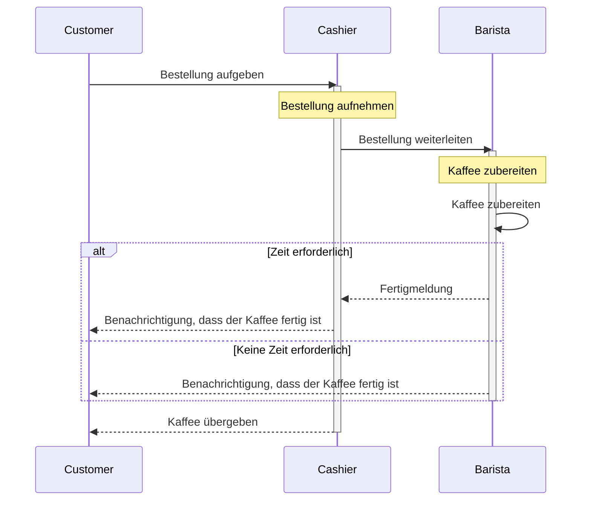

# Verteilte Systeme Portfolio Aufgabe
## Aufgabe 1: Architektur verteilter Systeme
### (a) 

##### Welche Teile des Prozesses laufen synchron und welche asynchron?
- Synchron: Die Bestellung aufgeben und die Kaffeeübergabe an den Kunden erfolgen synchron. Dies bedeutet, dass der Kunde auf die Bestätigung seiner Bestellung und den Erhalt seines Kaffees wartet.
- Asynchron: Die Zubereitung des Kaffees ist asynchron, da der Barista den Kaffee vorbereitet, während der Kunde und der Kassierer\*innen andere Aktivitäten ausführen können.
##### Warum ist der Prozess aus Kundensicht halb-synchron?
- Aus Kundensicht ist der Prozess halb-synchron, weil der Kunde nach Aufgabe seiner Bestellung und Bezahlung warten muss, bis der Kaffee fertig ist. Der Kunde muss also auf die Fertigstellung des Kaffees warten, bevor er ihn erhält, aber er kann währenddessen andere Aktivitäten ausführen.
##### Werden die Kaffees immer in der Reihenfolge ihrer Bestellung gemacht?
- In vielen Fällen werden Kaffees in der Reihenfolge ihrer Bestellung gemacht. Allerdings kann es Ausnahmen geben, wenn bestimmte Bestellungen vorrangig sind oder es durch die Arbeitsschritte von Vorteil wäre.
##### Wenn nein, wie wird sichergestellt, dass jede/r Kund\*in den richtigen Kaffee erhält?
- Um sicherzustellen, dass jeder Kunde den richtigen Kaffee erhält, können verschiedene Methoden verwendet werden. Beispielsweise könnten die Kaffees mit Bestellnummern oder Namen versehen werden, um sie den richtigen Kunden zuzuordnen. Ein effizientes Managementsystem könnte auch die Bestellungen und die zugehörigen Kaffees verfolgen, um Verwechslungen zu vermeiden.
##### Und wie wird sichergestellt, dass jeder Kaffee vor der Abholung bezahlt wurde?
- Die Bezahlung vor der Abholung des Kaffees kann durch verschiedene Methoden sichergestellt werden, z. B. durch Bezahlung an der Kasse oder durch vorherige Online-Zahlung. Das Kassensystem könnte sicherstellen, dass jeder Kaffee erst herausgegeben wird, wenn er bezahlt wurde. Dies kann auch durch das Vorzeigen eines Zahlungsbelegs oder durch das Scannen eines Codes bestätigt werden, um den abgehenden Kaffee freizugeben.
### (b)
```mermaid
```
### (c)
In der halb-synchronen Variante des Prozesses können Kassierer\*innen und Baristas unabhängig voneinander horizontal skaliert werden, was bedeutet, dass ihre Anzahl je nach Bedarf erhöht oder verringert werden kann. Dies ist vorteilhaft, weil:

##### Flexibilität und Anpassungsfähigkeit:
Durch das unabhängige Skalieren können Ressourcen entsprechend der aktuellen Nachfrage angepasst werden. Wenn beispielsweise zu Stoßzeiten mehr Bestellungen eingehen, können mehr Baristas eingesetzt werden, um die Kaffees schneller zuzubereiten, während die Anzahl der Kassierer\*innen konstant bleiben kann.

##### Effizienzsteigerung:
Durch die Anpassung der Anzahl der Kassierer\*innen und Baristas an die Nachfrage können Engpässe und Überlastungen vermieden werden. Dies trägt zur Effizienz des Betriebs bei und minimiert Wartezeiten für die Kunden.

Ein Szenario, in dem eine ungleiche Anzahl von Kassierer\*innen und Baristas sinnvoll ist, könnte folgendermaßen aussehen:

Angenommen, es handelt sich um einen Coffee-Shop, der sowohl vor Ort als auch online Bestellungen entgegennimmt. Während Stoßzeiten wie dem Morgenverkehr vor Ort mehr Kunden an die Kasse kommen, könnten online Bestellungen konstant eingehen. In diesem Fall wäre es sinnvoll, mehr Kassierer\*innen vor Ort bereitzustellen, um den Ansturm der Kunden zu bewältigen, während die Anzahl der Baristas, die die online Bestellungen bearbeiten, konstant bleiben könnte. Auf diese Weise können sowohl die Kunden vor Ort als auch die Kunden, die online bestellen, effizient bedient werden, ohne dass die Ressourcen verschwendet werden.
### (d)
##### Wie müsste man sich dessen Einsatz in einem Coffee Shop grob vorstellen (keine Details)?
Das Zwei-Phasen-Commit-Protokoll würde in einem Coffee Shop grob wie folgt eingesetzt werden:
- In der Vorbereitungsphase leitet der Kassierer die Bestellungen an den Barista weiter, der dann die Zubereitung der Getränke vorbereitet.
- In der Bestätigungsphase informiert der Barista den Kassierer\*innen über die Fertigstellung der Bestellungen, und der Kassierer\*innen gibt den Kund\*innen Bescheid, dass ihre Bestellung fertig ist und übergeben werden kann.
##### Warum handelt es sich bei dem Beispiel stattdessen um ein optimistisches Transaktionsmodell?
Das Beispiel in einem Coffee Shop repräsentiert ein optimistisches Transaktionsmodell, weil:
- Die meisten Kund\*innen in einem Coffee Shop davon ausgehen, dass ihre Bestellung erfolgreich abgewickelt wird, und daher im Voraus bezahlen.
- Es wird angenommen, dass Fehler wie falsche Bestellungen oder falsche Getränke selten auftreten und leicht behoben werden können, ohne dass eine komplexe synchronisierte Kommunikation zwischen Kassierer\*in und Barista erforderlich ist.
##### Begriffe Write-Off, Retry & Compensating Action
Online-Bestellung mit Rücksendemöglichkeit:
- Beispiel: Sie bestellen Kleidung online und erhalten ein falsches Produkt oder die Größe passt nicht.
- Write-Off (Abschreiben): Das Unternehmen könnte die Kosten für die Rücksendung übernehmen und die Rücksendung akzeptieren, ohne das falsche Produkt zurückzusenden.  
- Retry (Wiederholen): Das Unternehmen bietet Ihnen an, das richtige Produkt erneut zu senden oder den Betrag zu erstatten, wenn das falsche Produkt zurückgesendet wird.
- Compensating Action (Ausgleichende Maßnahme): Das Unternehmen könnte Ihnen einen Gutschein für Ihren nächsten Einkauf anbieten, um die Unannehmlichkeiten auszugleichen.
Fehlerhafte Transaktionen im Finanzbereich:
- Beispiel: Eine Überweisung zwischen Bankkonten läuft aufgrund eines technischen Fehlers fehl.
- Write-Off (Abschreiben): Die Bank könnte die Gebühren für die fehlgeschlagene Transaktion erlassen und den Betrag zurückerstatten.
- Retry (Wiederholen): Die Bank könnte versuchen, die Überweisung erneut durchzuführen, um sicherzustellen, dass sie erfolgreich ist.
- Compensating Action (Ausgleichende Maßnahme): Die Bank könnte Ihnen einen kleinen Bonus für die Unannehmlichkeiten anbieten oder die Transaktionsgebühren für eine gewisse Zeit erlassen.

In diesen Beispielen zeigt sich, wie Unternehmen und Organisationen auf Fehler bei optimistischen Transaktionen reagieren können, indem sie entweder den Fehler abschreiben, ihn erneut versuchen oder eine ausgleichende Maßnahme anbieten, um die Kundenzufriedenheit aufrechtzuerhalten und mögliche Verluste zu minimieren.
## Aufgabe 2: Rest-Webservices
### (a)
### (b)
## Aufgabe 3: Asynchroner Nachrichtenaustausch
### (a)
### (b)
## Aufgabe 4: Wahlvertiefungen

