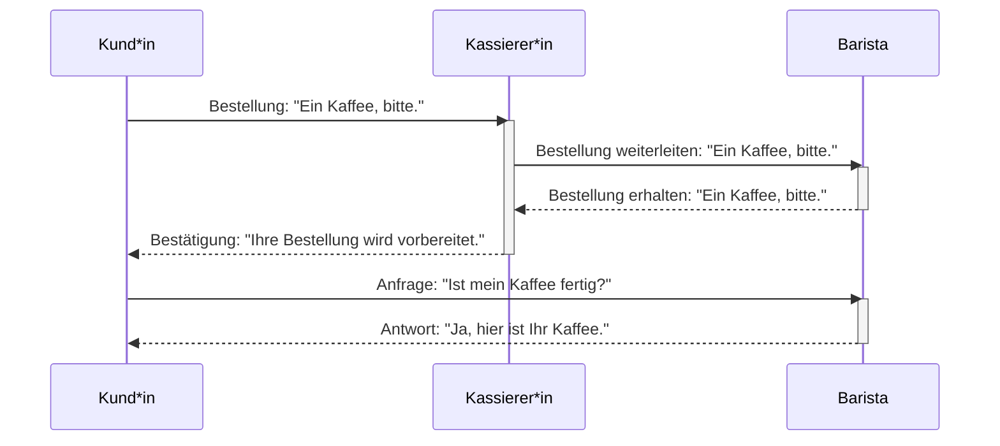
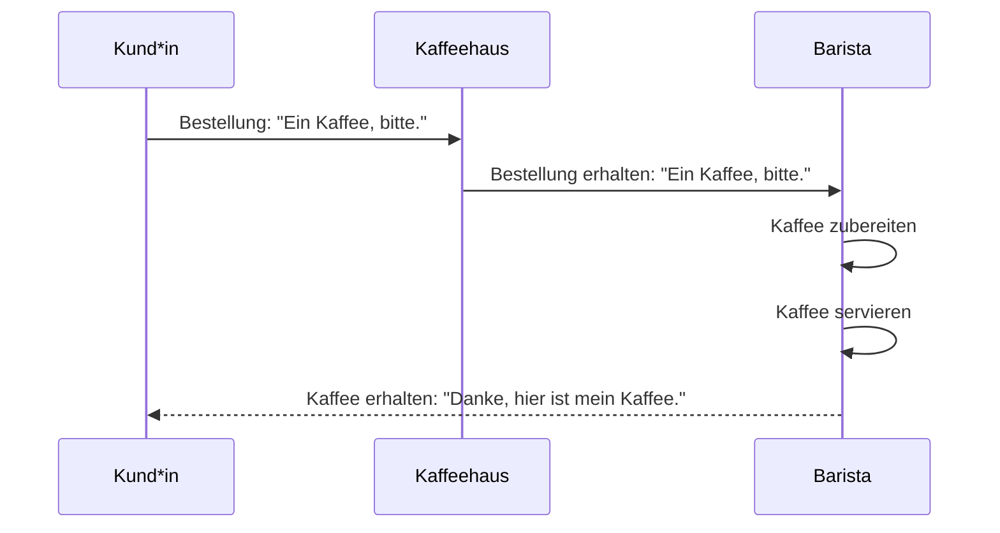
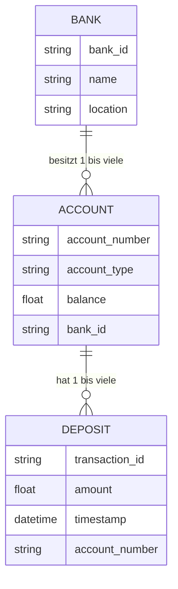
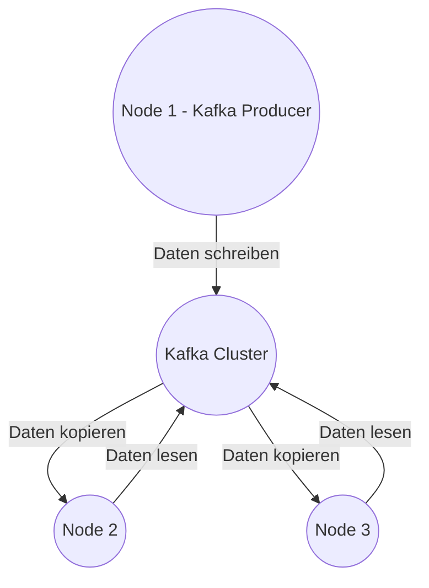

# Verteilte Systeme Portfolio Aufgabe
Tim Paschke
Matrikelnummer: 5939488
## Aufgabe 1: Architektur verteilter Systeme
### (a) 

##### **Welche Teile des Prozesses laufen synchron und welche asynchron?**
Die Interaktion zwischen Kund\*in und Kassierer\*in ist synchron, da die Kund*\in auf die Bestätigung ihrer Bestellung durch die Kassierer\*in wartet.
Die Interaktionen zwischen Kassierer\*in und Barista sind asynchron, da die Kassierer\*in die Bestellung an den Barista weiterleitet und der Barista den Kaffee zubereitet, während die Kund\*in auf die Bestätigung wartet.

##### **Warum ist der Prozess aus Kundensicht halb-synchron?**
Der Prozess ist halb-synchron, da die Kund\*in auf die Bestätigung ihrer Bestellung durch die Kassierer\*in warten muss, während die Zubereitung des Kaffees durch den Barista asynchron erfolgt.
  
##### **Werden die Kaffees immer in der Reihenfolge ihrer Bestellung gemacht?**
Nein, das Diagramm zeigt nicht explizit, dass die Kaffees in der Reihenfolge ihrer Bestellung gemacht werden. Die Bestellung wird möglicherweise in der Reihenfolge weitergeleitet, in der sie eingegangen ist, aber die Zubereitung kann variieren, je nachdem, wie viel Zeit die Zubereitung des Kaffees benötigt und wie viele Bestellungen gleichzeitig bearbeitet werden.

##### **Wenn nein, wie wird sichergestellt, dass jede/r Kund*\in den richtigen Kaffee erhält?**
Die Kassierer\*in könnte möglicherweise die Bestellung mit einer eindeutigen Kennung versehen und diese Kennung dann an den Barista weitergeben, um sicherzustellen, dass jeder Kaffee der richtigen Bestellung zugeordnet ist.

##### **Und wie wird sichergestellt, dass jeder Kaffee vor der Abholung bezahlt wurde?**
Dieses Diagramm berücksichtigt nicht explizit den Bezahlvorgang. Es könnte jedoch angenommen werden, dass die Bezahlung entweder vor oder während der Bestellung durchgeführt wird, möglicherweise durch einen separaten Vorgang, der nicht im Diagramm enthalten ist. Alternativ könnte die Bezahlung erfolgen, nachdem die Bestellung durch die Kassierer\*in bestätigt wurde, bevor der Barista mit der Zubereitung beginnt.
### (b)
Mermaid ist eine Text-basierte Diagramm-Syntax, mit der verschiedene Diagrammtypen, einschließlich UML-Sequenzdiagrammen, in Markdown erstellt werden können. Hier ist eine Darstellung des UML-Sequenzdiagramms für den Prozess von der Bestellung bis zum Erhalt des Kaffees:

Dieses Diagramm stellt den Prozess dar, wie ein Kaffee von der Bestellung durch den Kunden bis zur Zubereitung und Servierung durch den Barista verläuft. Der Kommunikationsfluss zwischen den Akteuren (Kund\*in, Kaffeehaus und Barista) wird durch Pfeile dargestellt, die die Nachrichtenübermittlung darstellen.
### (c)
In der halb-synchronen Variante des Prozesses können Kassierer\*innen und Baristas unabhängig voneinander horizontal skaliert werden, was bedeutet, dass ihre Anzahl je nach Bedarf erhöht oder verringert werden kann. Dies ist vorteilhaft, weil:

##### Flexibilität und Anpassungsfähigkeit:
Durch das unabhängige Skalieren können Ressourcen entsprechend der aktuellen Nachfrage angepasst werden. Wenn beispielsweise zu Stoßzeiten mehr Bestellungen eingehen, können mehr Baristas eingesetzt werden, um die Kaffees schneller zuzubereiten, während die Anzahl der Kassierer\*innen konstant bleiben kann.

##### Effizienzsteigerung:
Durch die Anpassung der Anzahl der Kassierer\*innen und Baristas an die Nachfrage können Engpässe und Überlastungen vermieden werden. Dies trägt zur Effizienz des Betriebs bei und minimiert Wartezeiten für die Kunden.

Ein Szenario, in dem eine ungleiche Anzahl von Kassierer\*innen und Baristas sinnvoll ist, könnte folgendermaßen aussehen:

Angenommen, es handelt sich um einen Coffee-Shop, der sowohl vor Ort als auch online Bestellungen entgegennimmt. Während Stoßzeiten wie dem Morgenverkehr vor Ort mehr Kunden an die Kasse kommen, könnten online Bestellungen konstant eingehen. In diesem Fall wäre es sinnvoll, mehr Kassierer\*innen vor Ort bereitzustellen, um den Ansturm der Kunden zu bewältigen, während die Anzahl der Baristas, die die online Bestellungen bearbeiten, konstant bleiben könnte. Auf diese Weise können sowohl die Kunden vor Ort als auch die Kunden, die online bestellen, effizient bedient werden, ohne dass die Ressourcen verschwendet werden.
### (d)
##### Wie müsste man sich dessen Einsatz in einem Coffee Shop grob vorstellen (keine Details)?
Das Zwei-Phasen-Commit-Protokoll würde in einem Coffee Shop grob wie folgt eingesetzt werden:
- In der Vorbereitungsphase leitet der Kassierer die Bestellungen an den Barista weiter, der dann die Zubereitung der Getränke vorbereitet.
- In der Bestätigungsphase informiert der Barista den Kassierer\*innen über die Fertigstellung der Bestellungen, und der Kassierer\*innen gibt den Kund\*innen Bescheid, dass ihre Bestellung fertig ist und übergeben werden kann.
##### Warum handelt es sich bei dem Beispiel stattdessen um ein optimistisches Transaktionsmodell?
Das Beispiel in einem Coffee Shop repräsentiert ein optimistisches Transaktionsmodell, weil:
- Die meisten Kund\*innen in einem Coffee Shop davon ausgehen, dass ihre Bestellung erfolgreich abgewickelt wird, und daher im Voraus bezahlen.
- Es wird angenommen, dass Fehler wie falsche Bestellungen oder falsche Getränke selten auftreten und leicht behoben werden können, ohne dass eine komplexe synchronisierte Kommunikation zwischen Kassierer\*in und Barista erforderlich ist.
##### Begriffe Write-Off, Retry & Compensating Action
Online-Bestellung mit Rücksendemöglichkeit:
- Beispiel: Sie bestellen Kleidung online und erhalten ein falsches Produkt oder die Größe passt nicht.
- Write-Off (Abschreiben): Das Unternehmen könnte die Kosten für die Rücksendung übernehmen und die Rücksendung akzeptieren, ohne das falsche Produkt zurückzusenden.  
- Retry (Wiederholen): Das Unternehmen bietet Ihnen an, das richtige Produkt erneut zu senden oder den Betrag zu erstatten, wenn das falsche Produkt zurückgesendet wird.
- Compensating Action (Ausgleichende Maßnahme): Das Unternehmen könnte Ihnen einen Gutschein für Ihren nächsten Einkauf anbieten, um die Unannehmlichkeiten auszugleichen.
Fehlerhafte Transaktionen im Finanzbereich:
- Beispiel: Eine Überweisung zwischen Bankkonten läuft aufgrund eines technischen Fehlers fehl.
- Write-Off (Abschreiben): Die Bank könnte die Gebühren für die fehlgeschlagene Transaktion erlassen und den Betrag zurückerstatten.
- Retry (Wiederholen): Die Bank könnte versuchen, die Überweisung erneut durchzuführen, um sicherzustellen, dass sie erfolgreich ist.
- Compensating Action (Ausgleichende Maßnahme): Die Bank könnte Ihnen einen kleinen Bonus für die Unannehmlichkeiten anbieten oder die Transaktionsgebühren für eine gewisse Zeit erlassen.

In diesen Beispielen zeigt sich, wie Unternehmen und Organisationen auf Fehler bei optimistischen Transaktionen reagieren können, indem sie entweder den Fehler abschreiben, ihn erneut versuchen oder eine ausgleichende Maßnahme anbieten, um die Kundenzufriedenheit aufrechtzuerhalten und mögliche Verluste zu minimieren.
## Aufgabe 2: Rest-Webservices
### (a)
Der Anwendungsfall besteht darin, dass Benutzer Bankkonten erstellen, Geld einzahlen und Geld abheben können.

### (b)

| Endpunkt                                                | HTTP-Verb | Aktion                      | Beschreibung                                         | JSON-Format Anfrage                              | JSON-Format Antwort                                                                                    |
| ------------------------------------------------------- | --------- | --------------------------- | ---------------------------------------------------- | ------------------------------------------------ | ------------------------------------------------------------------------------------------------------ |
| /banks                                                  | GET       | Alle Banken auflisten       | Ruft alle Banken ab                                  | -                                                | [{ "bank_id": "string", "name": "string", "location": "string" }, ...]                                 |
| /banks                                                  | POST      | Neue Bank erstellen         | Erstellt eine neue Bank                              | { "name": "string", "location": "string" }       | { "bank_id": "string", "name": "string", "location": "string" }                                        |
| /banks/{bank_id}                                        | GET       | Bankdetails abrufen         | Ruft die Details einer bestimmten Bank ab            | -                                                | { "bank_id": "string", "name": "string", "location": "string" }                                        |
| /banks/{bank_id}                                        | PUT       | Bankdetails aktualisieren   | Aktualisiert die Details einer bestimmten Bank       | { "name": "string", "location": "string" }       | { "bank_id": "string", "name": "string", "location": "string" }                                        |
| /banks/{bank_id}                                        | DELETE    | Bank löschen                | Löscht eine bestimmte Bank                           | -                                                | -                                                                                                      |
| /banks/{bank_id}/accounts                               | GET       | Konten einer Bank auflisten | Ruft alle Konten einer bestimmten Bank ab            | -                                                | [{ "account_number": "string", "account_type": "string", "balance": "float" }, ...]                    |
| /banks/{bank_id}/accounts                               | POST      | Neues Konto erstellen       | Erstellt ein neues Konto für eine bestimmte Bank     | { "account_type": "string", "balance": "float" } | { "account_number": "string", "account_type": "string", "balance": "float", "bank_id": "string" }      |
| /banks/{bank_id}/accounts/ {account_number}          | GET       | Kontodetails abrufen        | Ruft die Details eines bestimmten Kontos ab          | -                                                | { "account_number": "string", "account_type": "string", "balance": "float", "bank_id": "string" }      |
| /banks/{bank_id}/accounts/ {account_number}          | PUT       | Kontodetails aktualisieren  | Aktualisiert die Details eines bestimmten Kontos     | { "account_type": "string", "balance": "float" } | { "account_number": "string", "account_type": "string", "balance": "float", "bank_id": "string" }      |
| /banks/{bank_id}/accounts/ {account_number}          | DELETE    | Konto löschen               | Löscht ein bestimmtes Konto                          | -                                                | -                                                                                                      |
| /banks/{bank_id}/accounts/ {account_number}/deposits | POST      | Einzahlung tätigen          | Führt eine Einzahlung auf ein bestimmtes Konto durch | { "amount": "float" }                            | { "transaction_id": "string", "amount": "float", "timestamp": "datetime", "account_number": "string" } |
### (c) 
siehe **`Bank.js`**
## Aufgabe 3: Asynchroner Nachrichtenaustausch
### (a) 
siehe **`Empfänger.js`**, **`Sender.js`** & **`Gemeinsam.js`**
### (b)

Der typische Ablauf bei Änderung eines Werts durch einen der Knoten, während einer der anderen Knoten temporär nicht erreichbar ist und später wieder online ist, könnte folgendermaßen aussehen:

1. **Initialer Zustand**: Alle drei Knoten (Node 1, Node 2 und Node 3) sind online und miteinander verbunden. Das Kafka-Cluster (Node B) fungiert als zentraler Punkt für die Datenreplikation.

2. **Änderung des Werts durch einen Knoten**: Angenommen, Node 1 ändert einen Wert und schreibt diese Änderung in das Kafka-Cluster (Node B). Das Kafka-Cluster repliziert die Änderung auf Node 2 und Node 3.

3. **Einer der Knoten wird temporär nicht erreichbar**: Nehmen wir an, Node 3 ist vorübergehend nicht erreichbar, sei es aufgrund eines Netzwerkproblems oder einer anderen Art von Ausfall. Während Node 3 offline ist, können keine Aktualisierungen auf diesem Knoten durchgeführt werden.

4. **Wiederherstellung des offline Knotens**: Zu einem späteren Zeitpunkt wird Node 3 wieder online. Da Kafka die Änderungen im Commit-Log speichert, kann Node 3 die fehlenden Aktualisierungen durch erneutes Lesen des Logs von Node B abrufen. Node 3 synchronisiert sich mit Node B, um sicherzustellen, dass es die neuesten Daten hat.

5. **Replikation der fehlenden Änderungen**: Das Kafka-Cluster (Node B) erkennt, dass Node 3 fehlende Aktualisierungen hat, und repliziert die fehlenden Daten von Node 1 oder Node 2 auf Node 3, um sicherzustellen, dass alle Knoten konsistente Daten haben.

Durch diese Vorgehensweise gewährleistet das Kafka-Cluster die Konsistenz der Daten, auch wenn temporäre Ausfälle einzelner Knoten auftreten.
## Aufgabe 4: Wahlvertiefungen
### OpenAPI
OpenAPI ist eine Spezifikation, die verwendet wird, um RESTful APIs zu definieren. Es bietet eine standardisierte Möglichkeit, APIs zu beschreiben, einschließlich der Endpunkte, der verfügbaren Operationen (wie GET, POST, PUT, DELETE), der erforderlichen Parameter und der erzeugten Antworten. OpenAPI ermöglicht es Entwicklern, APIs zu verstehen und zu nutzen, ohne detaillierte technische Kenntnisse über die zugrunde liegende Implementierung zu benötigen. Es fördert die Interoperabilität zwischen verschiedenen Systemen, da es einen einheitlichen Ansatz für die Dokumentation und Nutzung von APIs bietet.

Die Spezifikation von OpenAPI wird normalerweise in YAML- oder JSON-Format verfasst und enthält sowohl strukturelle als auch semantische Informationen über die API. Dies umfasst die Beschreibung der verfügbaren Pfade, die Parameter, die für jeden Endpunkt benötigt werden, die erwarteten Antworten und sogar Beispiele für Anfragen und Antworten.

OpenAPI wird oft in Kombination mit anderen Technologien verwendet, wie zum Beispiel Swagger, das eine Reihe von Tools zur Erstellung, Dokumentation und Verwendung von APIs basierend auf der OpenAPI-Spezifikation bietet.

**Fallbeispiel: OpenAPI in der Praxis**

Ein bekanntes Beispiel für die Verwendung von OpenAPI ist das Fallbeispiel von Twilio, einem Unternehmen, das Cloud-Kommunikationsplattformen für Entwickler bereitstellt. Twilio ermöglicht es Entwicklern, Kommunikationsfunktionen wie SMS-Versand, Anrufe und Video-Chats in ihre Anwendungen zu integrieren, indem sie APIs verwenden.

Durch die Verwendung von OpenAPI hat Twilio eine klare und umfassende Spezifikation seiner APIs erstellt. Entwickler können diese Spezifikation verwenden, um schnell und einfach zu verstehen, wie sie die Twilio-APIs verwenden können, um Kommunikationsfunktionen in ihre Anwendungen zu integrieren, ohne sich mit den internen Details der Twilio-Implementierung befassen zu müssen.

Die OpenAPI-Spezifikation von Twilio beschreibt alle verfügbaren Endpunkte, wie zum Beispiel `/Messages` für den SMS-Versand oder `/Calls` für Telefonanrufe. Sie definiert auch die erforderlichen Parameter für jede Anfrage, wie z.B. die Telefonnummer des Empfängers für einen Anruf oder den Text einer SMS. Darüber hinaus werden die erwarteten Antworten beschrieben, einschließlich der HTTP-Statuscodes und der Struktur der Antwortnachrichten.

Durch die Verwendung von OpenAPI können Entwickler, die Twilio verwenden möchten, schnell auf die API zugreifen, ohne Zeit mit der manuellen Analyse von Dokumentationen oder der Durchführung von Reverse Engineering zu verschwenden. Dies fördert die Effizienz und Produktivität der Entwickler und ermöglicht es Twilio, eine breitere Palette von Entwicklern anzusprechen, die ihre Kommunikationsfunktionen in ihre Anwendungen integrieren möchten.

Insgesamt zeigt das Beispiel von Twilio, wie OpenAPI dazu beitragen kann, APIs zu standardisieren, die Entwicklung zu beschleunigen und die Interoperabilität zwischen verschiedenen Systemen zu verbessern.